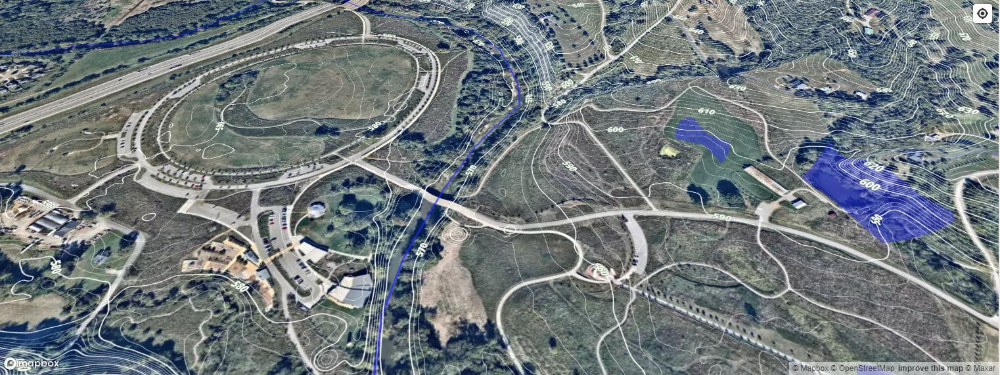
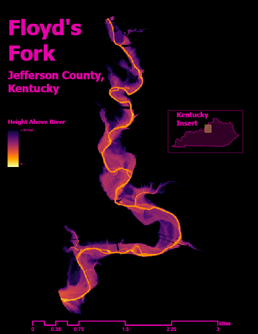

# Floyds Fork

[Link to GitHub pages site](http://127.0.0.1:5500/floydsfork/lesson-map/index.html)
Custom map of the Parklands of Floyds Fork

View of the Egg Lawn at The Parklands of Floyd's Fork 

The Parklands at Floyds Fork is a public/private park in Eastern Jefferson County. The parks offer numerous recreational activities to the community along a waterway.

The goal of my project is to visualize Floyds Fork and the surrounding parklands.

___
Page and visualizations created by Kyle Thorne for GEO 409, Department of Geography, University of Kentucky. Spring 2022.

Visualizations created from lidar data provided by KyFromAbove in ArcGIS Pro and Blender. Additional sources of information from name of source, April 18, 2022.
